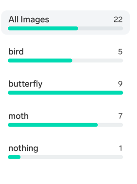

# Goal 1: Create and train your model

[Lobe] is a free, private desktop application that has everything you need to take your machine learning ideas from prototype to production. 

For this goal, your team will train a model using images either captured with your computer camera or imported into the desktop application. Future goals will focus on testing and running your trained model in a web application.

## What is machine learning?

Machine learning is software that learns to perform a task from a collection of examples rather than through a person explicitly defining rules and formulas. This learning software is called a `model`. Teaching a model through examples is called `training`.

### What is image classification?

Image classification is categorizing an image into a single label to represent its content. Apps using image classification could:

1. Identify a plant's species in the wild
1. Send you photos of a new bird that just started showing up at your bird feeder
1. Count the number of push-ups you’ve done in a workout
1. Alert you when a shelf is empty
1. Read signs in your environment

### Lobe

[Lobe] is not doing any reasoning or understanding of the content in your images. Image classification learns to find any patterns from your images - things like textures, colors, and shapes - that can be used to separate your labels.

Here are some helper questions to answer to make choosing your labels easier:

1. What information would clarify what is in the image?
1. How complex is the object?
1. How similar are the objects with the same label? How different are the objects that have different labels?

> 💡 The `None` label
>
> Make sure to use a catch-all label like `None` to show unrelated images.
>
> Lobe will always predict one of your labels even if your image does not contain any related content. If you expect your model to see these types of images, create a `None` label and add variations of these images as examples. You can use this `None` label as a placeholder when waiting for relevant predictions.

## Success criteria

Your team will work together to create and train a model using [Lobe]. Your team will have achieved this goal when the following success criteria are met:

- The model has 10-20 images for each label
- The model has at least 3-4 labels, not including the `None` label

## Resources

Your team might find these resources helpful:

- [What is labeling?](https://www.lobe.ai/docs/label/label)
- [What types of images should I collect?](https://www.lobe.ai/docs/label/label#accordion-what-types-of-images-should-i-collect)
- [Example image datasets from TensorFlow](https://www.tensorflow.org/datasets/catalog/overview#image_classification)

## Final result

After you finish training your model, you should see a page which looks like the following:

## Tips

💡 Be mindful of the capabilities of your team's computers! Here are some things that can impact the amount of compute power and/or time it will take to train your model:

- The number of images in your dataset
- The number of labels
- The average file size of the images in your dataset

💡 The label progress bars fill up as you add images. The number of photos needed will vary:

## Next challenge

Once you've trained your model, it's time to [fine tune it](./2-test.md).

<!-- References -->
[Lobe]: https://www.lobe.ai
